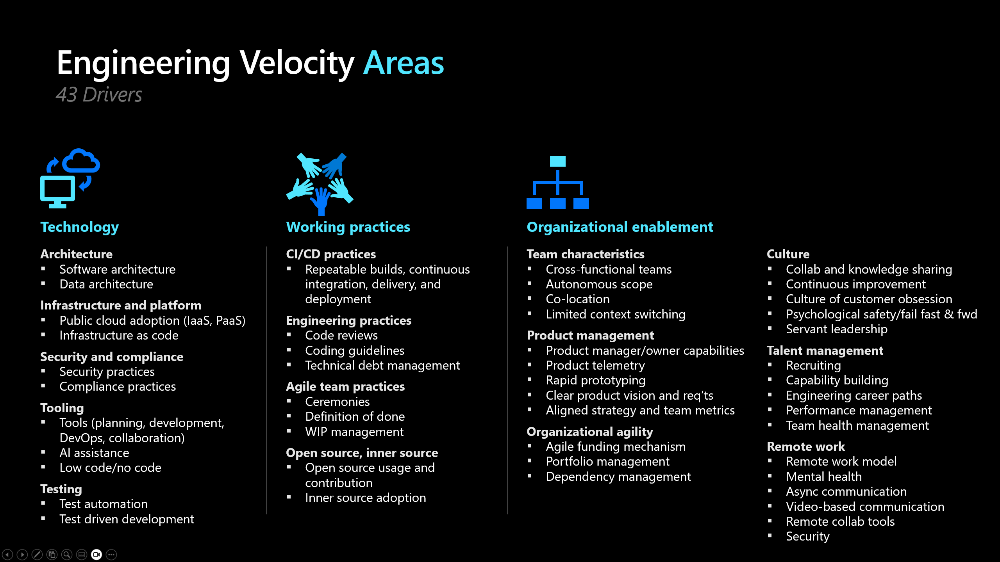
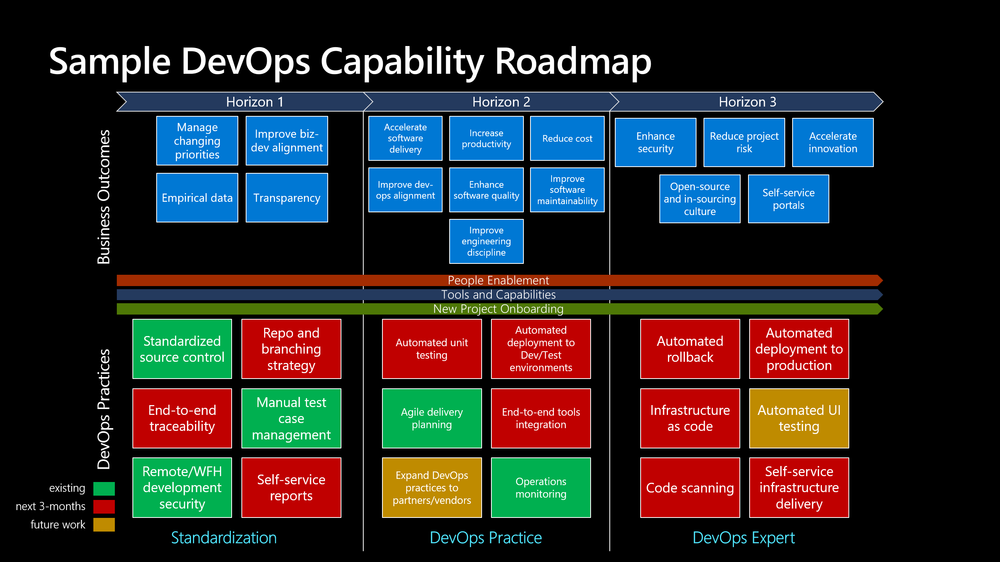
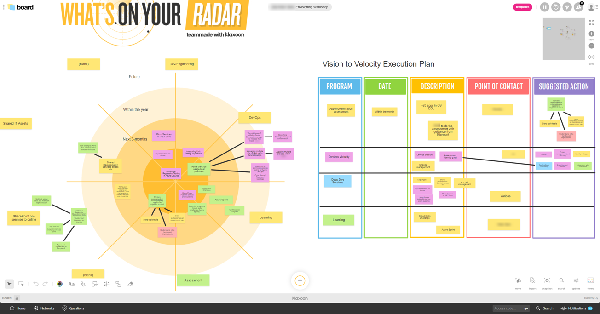
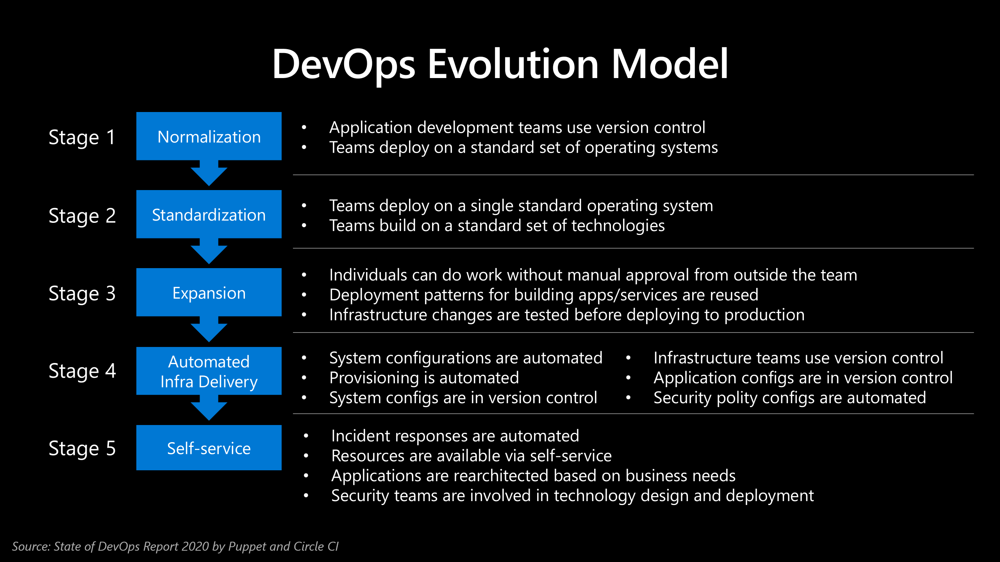

# Vision to Velocity
This workshop is about helping organizations increase their _Engineering Velocity*_

> [!NOTE]
> _Engineering Velocity_ is exactly what McKinsey calls [Developer Velocity](https://www.mckinsey.com/industries/technology-media-and-telecommunications/our-insights/developer-velocity-how-software-excellence-fuels-business-performance). I used the word _engineering_ because the idea applies to enterprise architects, infra engineers, QA engineers, and everyone else involed in delivering software.

---
## Sample Agenda
> [!IMPORTANT]
> Sample Objective: Increase developer productivity using DevSecOps adoption and developer tools.

### Day 1: Vision to Velocity
- **Morning (Presentation and Discussion)**
  - Introductions
  - What is Engineering Velocity?
  - Customer Stories
  - Discovery and Alignment of Objectives
  - Art-of-the-Possible Demonstration
- **Afternoon (Design Thinking)**
  - Rose, Thorn Bud
  - Affinity Clustering
  - 3 Horizon Planning using the Importance/Difficulty Matrix
  - Other Methods: User Journey Mapping, Process Mapping, What's on your Radar
  - Output: Vision to Velocity Sreams of Work

### Day 2: DevSecOps and Productivity Tools
- **Morning (Presentation and Discussion)**
  - What is DevSecOps?
  - DevOps Evolution Model
  - DevSecOps Toolchain
  - AI for Developers
- **Afternoon (Hands-on)**
  - see [Hands-on Labs](https://github.com/raffertyuy/razhandsonlabs)

---
## Sample Outcomes
## DevOps Capability Roadmap

## Vision to Velocity: Streams of Work

---
## Useful References
### DevOps Evolution Model

